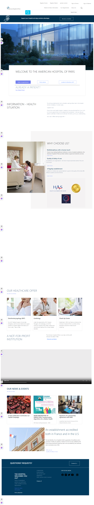
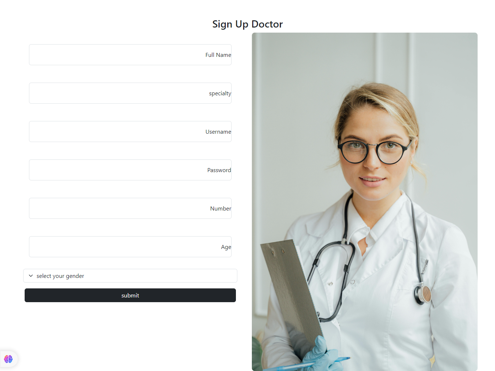
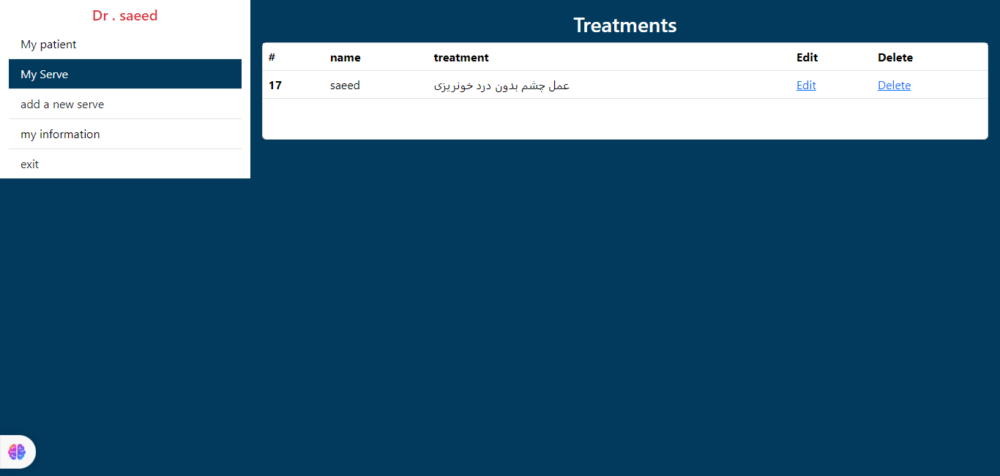
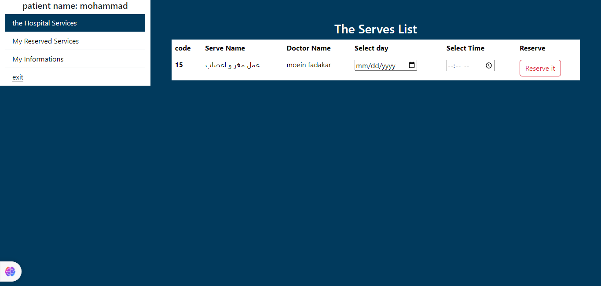

#  This Is Hospital ?

* This is a hospital project that doctors and patients relate to each other  and they can Reserve time adn doctors can add new treatments , delete or update there treatments and this can work like a real system of a hospital

## What are the features of this program?

* Reserve A Time for Treatment
* See doctor Information
* Add Different type 
* Delete treatments 
* Edit Treatments

## what features will be add soon?

* [x] Sign In and Sign up  
* [ ] add more doctors 
* [ ] Responsive 

## Sources , languages , library`s and  frameworks 
 
* 1-[HTML](https://html.com/)
* 2-[CSS](https://www.w3.org/Style/CSS/)
* 3-[Java Script](https://www.javascript.com/)
* 4-[PHP](https://www.php.net/)
* 5-[Mysql](https://www.mysql.com/)
* 6-[bootstrap](https://getbootstrap.com/)

<h3> ✨ Tech</h3>

  

## Screenshot`s of This Project  

* Home

* Register

* panel 1

* panel 

